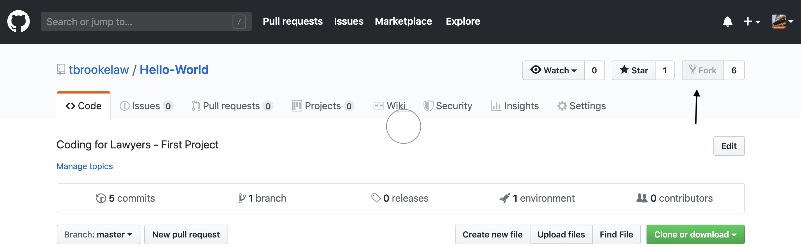
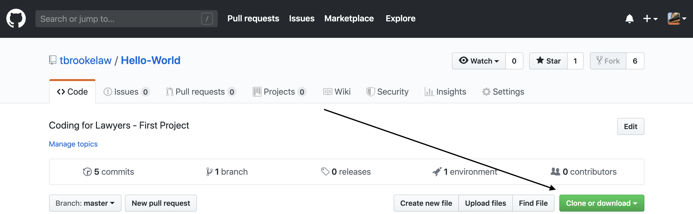
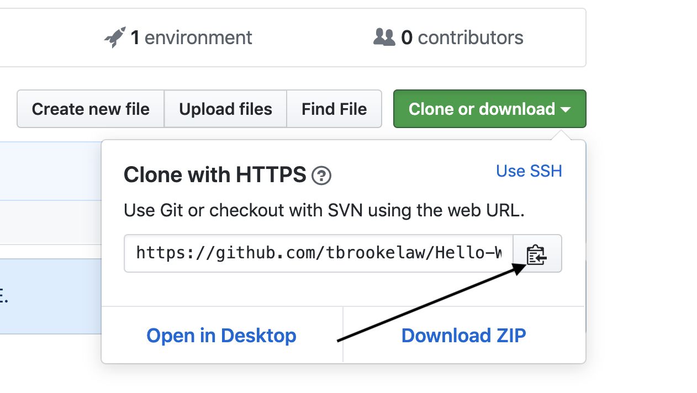
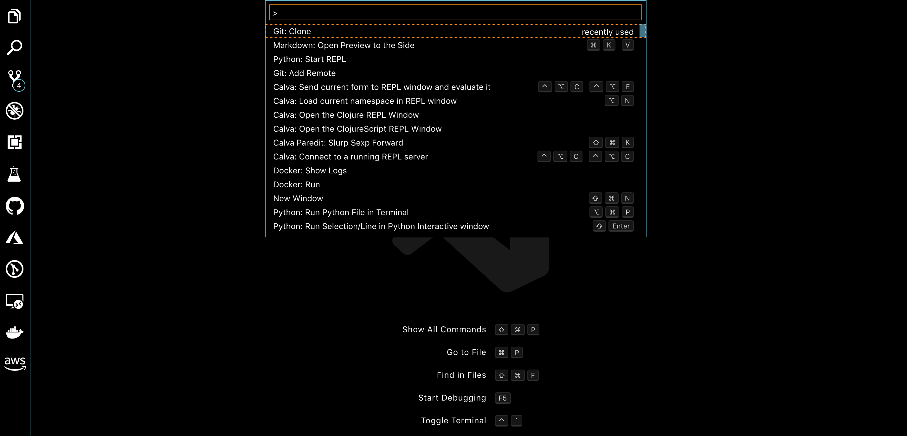
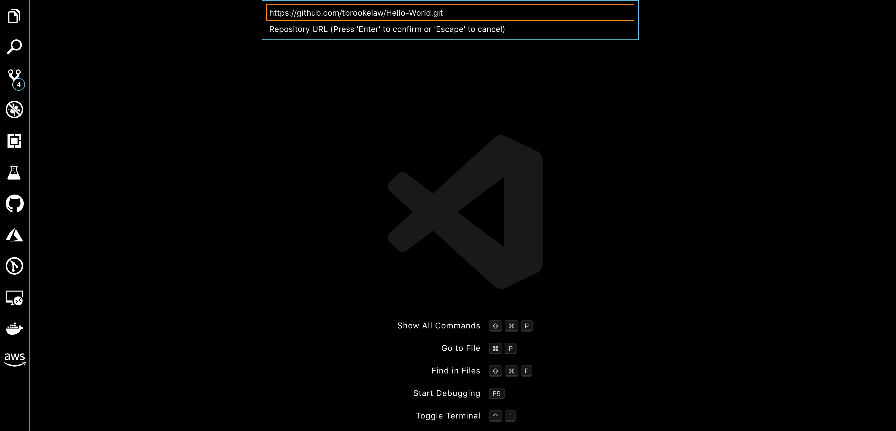

# HELLO WORLD

## Hello World # 1

### Interactive Python

* Open Terminal
* type  python3

```

Campbell-2019 python3
Python 3.7.3 (default, Mar 27 2019, 16:54:48)
[Clang 4.0.1 (tags/RELEASE_401/final)] :: Anaconda, Inc. on darwin
Type "help", "copyright", "credits" or "license" for more information.
>>>
```

* type print("Hello World")

```python

>>> print("Hello World")
Hello World
>>>
```

Good Job 🎉

## Hello World # 2 -- With a Variable

* msg = "Hello World"
* print(msg)

```python

>>>
>>> msg = "Hello World"
>>> print(msg)
Hello World
>>>
```

 ## Hello World #3 

### Let's fork it and pull it down

 * Go to => [Hello World](https://github.com/tbrookelaw/Hello-World)

 * Push the Fork it Button

 

___
 ### To use Git locally besides having VS-Code you must Have  Git to install git go to => [GIT](https://git-scm.com/downloads)<= and follow the instructions to install it.
 Enter the following from the cmmand line to set up Git:

  git config --global user.name "Emma Paris"
  
  git config --global user.email "eparis@atlassian.com"
___

 * Go to the repository that you created
 * Find the Clone button

 

 * Copy the URL - using https option with the little clipboard)

 


### Put it in VSCode

  * Use Shift-Command-P (on the Mac) Ctrl-shift-P (On windows)
    * type git scroll to git:clone

    

  * Paste in the url you copied from github

    

## Edit it

* click on the top upper left Icon to view all the files
* Select Hello.py
* add:

```python
msg="Hello World"
print(msg)
```
* Right click - on Windows double click on Mac 

* Select Run Code

## You did it!

# Put it on Github

* Make sure you have saved everything
* click the fork button in the upper left of VSCode - below the magnifying glass
* Enter a commit message => finished Hello World
* click on the check mark - right above the message box
* click on the 3 dots beside the check mark 
* select push on the drop down


## You are done


